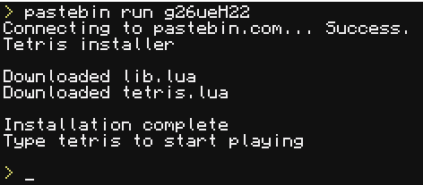
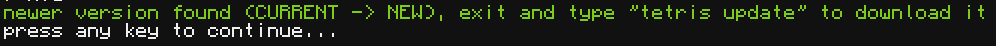
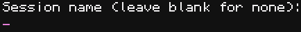
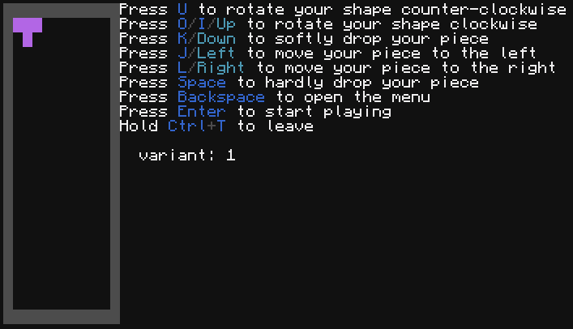
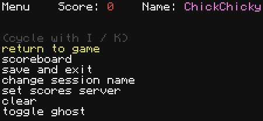

# ComputerCraft Tetris

This project is meant to be used on Computercraft, a Minecraft mod that can be downloaded from [curseforge](https://www.curseforge.com/minecraft/mc-mods/cc-tweaked), there is also a desktop adaptation available on computer and mobile, [CraftOS-PC](https://www.craftos-pc.cc/).

---

## Installing

You can directly clone this repo into the computer's files or run `pastebin run g26ueH22` to launch the installer.


---

## Updating
When a new update comes out, when you launch Tetris this message will be shown:<br>

You can press a key and continue normally or hold <kbd>Ctrl</kbd>+<kbd>T</kbd> to exit and then type `tetris update`.<br>
Alternatively, you can type `pastebin run g26ueH22` which basically does the same thing.

---

## Simple guide

Once installed, you can run the `turtle` command and you will see this:


You can input a name that will be associated with the scores you get, but you can leave it empty if you want.<br>
After pressing <kbd>Enter</kbd>, you will see a quick tutorial that shows you the controls, and the tetromino just wraps around when touching the bottom line.<br>


When you press <kbd>Enter</kbd> again, you now start playing the real game.<br>


By pressing <kbd>Return</kbd>, a menu with 6 "buttons" opens.<br>

- **Return to game**: just exits out of the menu, same thing as pressing <kbd>Return</kbd> again
- **Scoreboard**: displays all your local scores as well as the configured SS' (look at [this](#Scores-Server) for more info)
- **Save and exit**: saves your score and quits Tetris, same thing as holding <kbd>Ctrl</kbd>+<kbd>T</kbd>
- **Change session name**: nothing really fancy, just asks you a new name
- **Set scores server**: more info [here](#Scores-Server)
- **Clear**: clears the board and resets your score **BUT IT DOES NOT SAVE**
- **Toggle ghost**: toggles the projection of where your piece will land

---

## Scoring
Earninig points is pretty simple, it can be done by competing lines:
|               |      |      |      |      |
|---------------|:----:|:----:|:----:|:----:|
|number of lines|  1   |  2   |  3   |  4   |
|    points     |  40  | 100  | 300  | 1200 |
Moving manually down a piece also rewards points, 1 every 20 placed pieces starting from 1


# Advanced stuff

## Scores Server
A score server allows to store players' scores on a server rather than locally. <br>
Here's an example of a score server written in JS:
```js
const http = require('http');
const fs = require('fs');

function load_db() {
    return JSON.parse(fs.readFileSync('./db.json','utf-8'));
}

const addr = {
    port: 80, // standard HTTP port
    host: 'YOUR-HOST-HERE'
}

let server = http.createServer(function(req,res){
    let url = new URL(req.url,`http://${addr.host}`);
    let pathName = url.pathname;
    
    if (pathName == '/sstetris') {

        let {action,payload} = req.headers;

        res.writeHead(200);

        if (action == 'ping') {
            // just responds to the ping
            res.end(JSON.stringify('pong'));
        }

        if (action == 'get') {
            // returns the scores stored in the DB
            res.end(JSON.stringify(load_db().sstetris??[]));
        }

        if (action == 'save') {
            let dat = JSON.parse(payload); // parsed the score data
            let db = load_db(); // loads the DB

            db.sstetris = (db.sstetris??[]).concat(dat); // adds the score to the existing ones

            // writes the DB data back into the file
            fs.writeFileSync('./db.json',JSON.stringify(db));
            res.end(JSON.stringify('OK'));
        }

    }
});

server.listen(addr.port, addr.host, 1, function() {
    console.log('ready');
});
```
A Tetris client will only use 3 request types: `ping`, `get`, `save` which are stored in the `action` header
- **ping**: this is sent when trying to set the SS in the menu, this is to ensure the server can be joined, it doesn't execpt any particular response, the server just has to respond
- **get**: this is sent when loading the scores from the scoreboard, it expects the server to respond with an array containing [score-like objects](#scores)
- **save**: this is sent when the clients wants to register a new score on the server, the score data can be found in the `payload` header, as a [score-like object](#scores), no particular response is expacted from the server